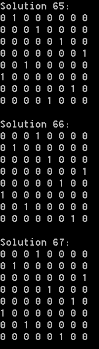

# CPP_eight-queens

Print all the Eight Queens Solutions 
Using 1D-array

skills: C++ | Algorithm

## What is Eight Queens Puzzle?

The eight queens puzzle is the problem of placing eight chess queens on an 8×8 chessboard so that no two queens threaten each other. 
A solution requires that no two queens share the same row, column, or diagonal.
